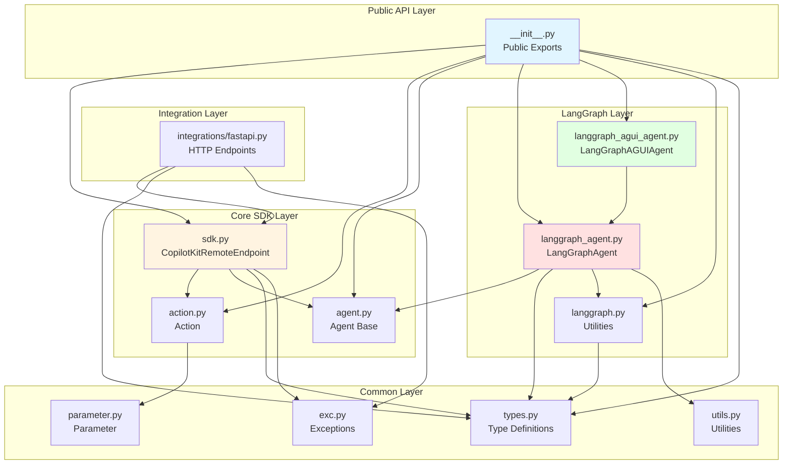
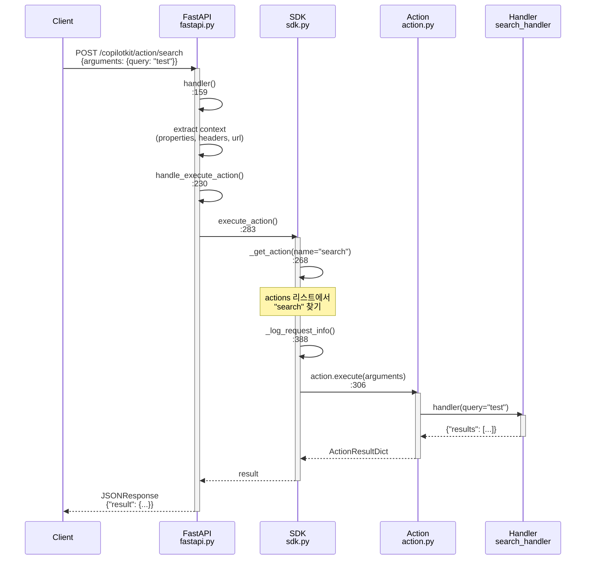
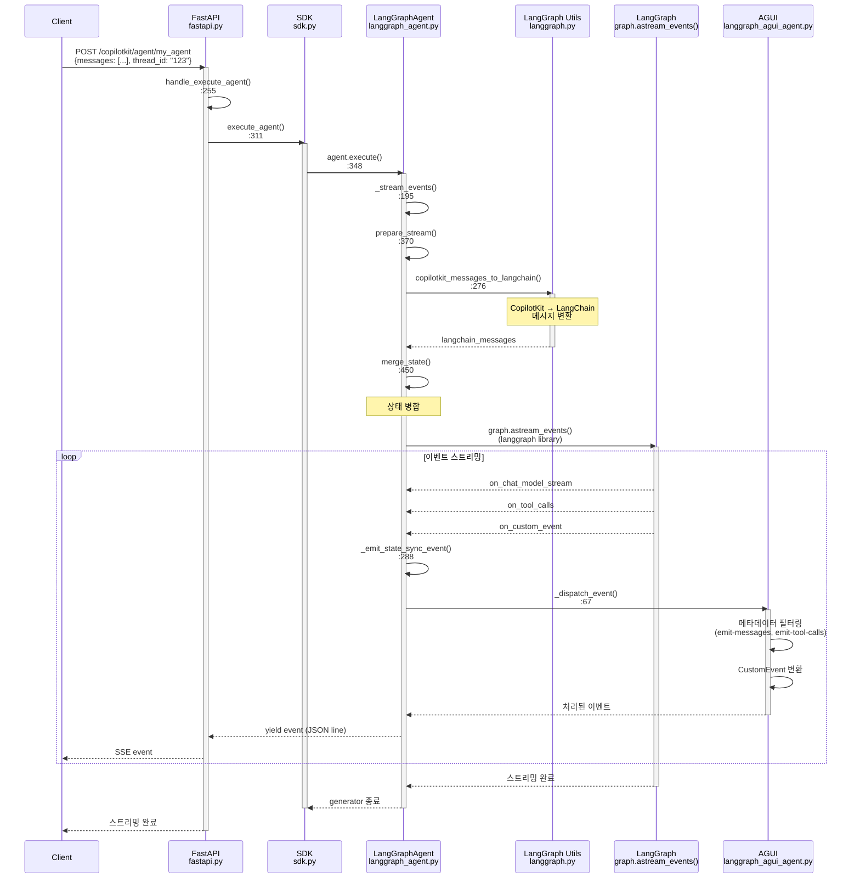
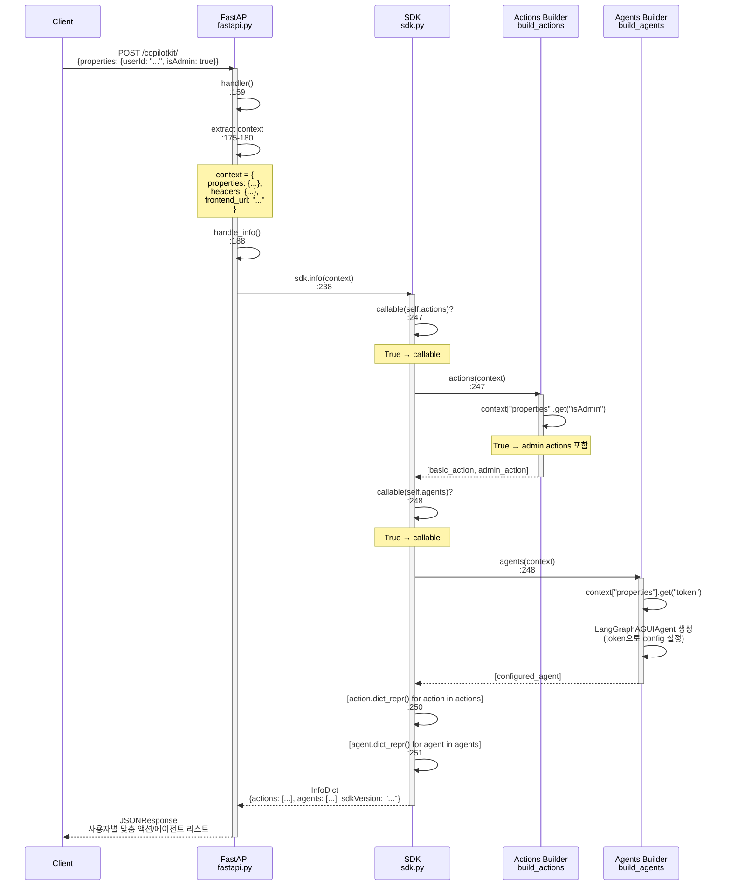
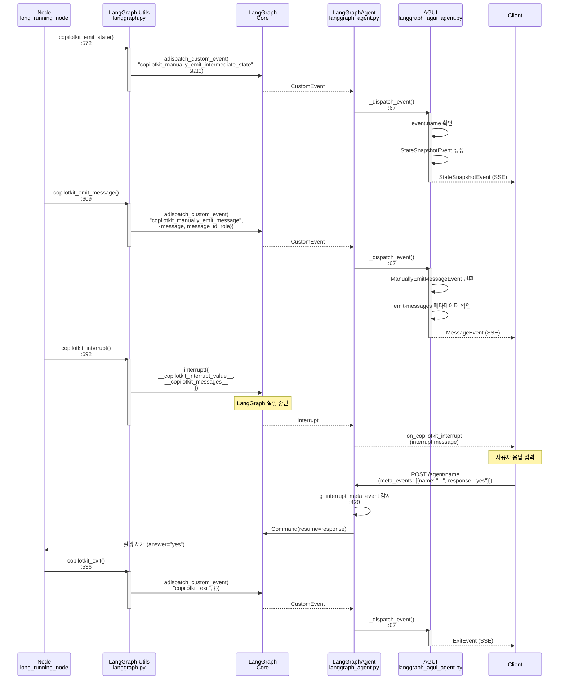
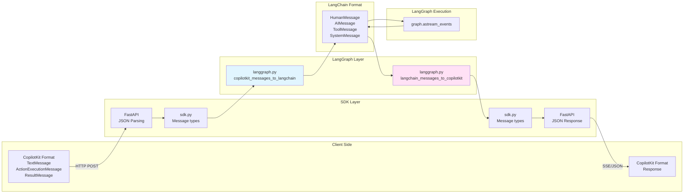
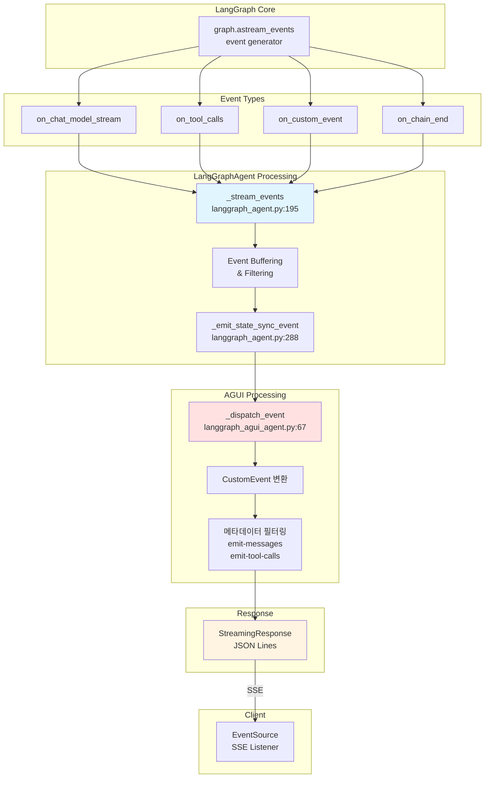

# CopilotKit SDK 코드 네비게이션 가이드

이 문서는 CopilotKit Python SDK의 내부 구조와 모듈 간 연결 관계를 설명합니다.
SDK를 확장하거나 내부 동작을 이해하고 싶을 때 참고하세요.

**작성일**: 2025-10-28
**대상**: SDK 내부 구조를 이해하고 싶은 개발자

---

## 목차

1. [Entry Points (진입점)](#entry-points-진입점)
2. [Module Dependencies (모듈 의존성)](#module-dependencies-모듈-의존성)
3. [Code Path Scenarios (시나리오별 코드 경로)](#code-path-scenarios-시나리오별-코드-경로)
4. [Data Flow (데이터 흐름)](#data-flow-데이터-흐름)
5. [Key Classes (주요 클래스)](#key-classes-주요-클래스)
6. [Quick Reference (빠른 참조)](#quick-reference-빠른-참조)

---

## Entry Points (진입점)

### Public API Entry Points

**파일**: `copilotkit/__init__.py`

사용자가 SDK를 사용할 때 import하는 주요 클래스들:

```python
from copilotkit import (
    # 메인 SDK 클래스
    CopilotKitRemoteEndpoint,  # SDK 진입점, 액션/에이전트 관리

    # 액션 관련
    Action,                     # 액션 정의
    Parameter,                  # 액션 파라미터 정의

    # 에이전트 관련
    Agent,                      # 에이전트 기본 클래스
    LangGraphAgent,            # LangGraph 에이전트 (deprecated, 직접 사용 불가)
    LangGraphAGUIAgent,        # LangGraph AGUI 에이전트 (권장)

    # 상태 및 타입
    CopilotKitState,           # LangGraph 상태 정의
    CopilotKitContext,         # 컨텍스트 타입
)
```

**위치**: `copilotkit_sdk/copilotkit/__init__.py:17-25`

### Integration Entry Points

**파일**: `copilotkit/integrations/fastapi.py`

FastAPI와 통합할 때 사용하는 함수:

```python
from copilotkit.integrations.fastapi import add_fastapi_endpoint

# FastAPI 앱에 CopilotKit 엔드포인트 추가
add_fastapi_endpoint(app, sdk, "/copilotkit")
```

**위치**: `copilotkit_sdk/copilotkit/integrations/fastapi.py:119`

**생성되는 엔드포인트**:
- `GET /copilotkit/` - SDK 정보 조회 (HTML)
- `POST /copilotkit/` - SDK 정보 조회 (JSON)
- `POST /copilotkit/action/{name}` - 액션 실행
- `POST /copilotkit/agent/{name}` - 에이전트 실행 (스트리밍)
- `GET /copilotkit/agent/{name}/state` - 에이전트 상태 조회

---

## Module Dependencies (모듈 의존성)

### Overall Architecture



### Detailed Dependencies

#### Core Modules

**`sdk.py`** (CopilotKitRemoteEndpoint):
- `action.py` → Action, ActionDict, ActionResultDict
- `agent.py` → Agent, AgentDict
- `types.py` → Message, MetaEvent
- `exc.py` → 모든 예외 클래스
- `logging.py` → get_logger

**`langgraph_agent.py`** (LangGraphAgent):
- `agent.py` → Agent (상속)
- `types.py` → Message, MetaEvent
- `action.py` → ActionDict
- `langgraph.py` → 메시지 변환 함수들
- `utils.py` → filter_by_schema_keys
- 외부: `langgraph`, `langchain_core`

**`langgraph_agui_agent.py`** (LangGraphAGUIAgent):
- `langgraph_agent.py` → LangGraphAgent (상속)
- 외부: `ag_ui_langgraph`, `ag_ui.core`

**`integrations/fastapi.py`**:
- `sdk.py` → CopilotKitRemoteEndpoint, CopilotKitContext
- `types.py` → Message, MetaEvent
- `action.py` → ActionDict
- `exc.py` → 모든 예외 클래스
- `html.py` → generate_info_html

---

## Code Path Scenarios (시나리오별 코드 경로)

### 시나리오 1: 기본 액션 실행

**사용자 코드**:

```python
from copilotkit import CopilotKitRemoteEndpoint, Action
from copilotkit.integrations.fastapi import add_fastapi_endpoint
from fastapi import FastAPI

# 액션 핸들러 정의
async def search_handler(query: str):
    return {"results": ["result1", "result2"]}

# SDK 설정
sdk = CopilotKitRemoteEndpoint(
    actions=[
        Action(name="search", handler=search_handler, description="Search")
    ]
)

# FastAPI 통합
app = FastAPI()
add_fastapi_endpoint(app, sdk, "/copilotkit")
```

**코드 경로 (Request → Response)**:



**파일 경로 상세**:

1. `integrations/fastapi.py:159` - `handler()` 엔드포인트
2. `integrations/fastapi.py:175-180` - 컨텍스트 추출
3. `integrations/fastapi.py:230` - `handle_execute_action()`
4. `sdk.py:283` - `CopilotKitRemoteEndpoint.execute_action()`
5. `sdk.py:268` - `_get_action()` - 액션 검색
6. `sdk.py:388` - `_log_request_info()` - 로깅
7. `action.py:116` - `Action.execute()` - 핸들러 호출
8. 사용자 정의 핸들러 실행
9. 응답 반환 (역순)

---

### 시나리오 2: LangGraph Agent 실행 (스트리밍)

**사용자 코드**:

```python
from copilotkit import CopilotKitRemoteEndpoint, LangGraphAGUIAgent, CopilotKitState
from langgraph.graph import StateGraph
from langchain_core.messages import AIMessage

# LangGraph 정의
def my_node(state: CopilotKitState, config):
    return {"messages": [AIMessage(content="Hello!")]}

builder = StateGraph(CopilotKitState)
builder.add_node("agent", my_node)
builder.set_entry_point("agent")
builder.set_finish_point("agent")

graph = builder.compile(checkpointer=MemorySaver())

# Agent 설정
agent = LangGraphAGUIAgent(
    name="my_agent",
    graph=graph,
    description="A helpful assistant"
)

# SDK 설정
sdk = CopilotKitRemoteEndpoint(agents=[agent])
add_fastapi_endpoint(app, sdk, "/copilotkit")
```

**코드 경로 (Request → Streaming Response)**:



**파일 경로 상세**:

1. `integrations/fastapi.py:255` - `handle_execute_agent()`
2. `sdk.py:311` - `CopilotKitRemoteEndpoint.execute_agent()`
3. `langgraph_agent.py:153` - `LangGraphAgent.execute()`
4. `langgraph_agent.py:195` - `_stream_events()`
5. `langgraph_agent.py:370` - `prepare_stream()` 또는 `prepare_regenerate_stream()`
6. `langgraph.py:276` - `copilotkit_messages_to_langchain()` - 메시지 변환
7. `langgraph_agent.py:450` - `merge_state()` - 상태 병합
8. LangGraph 라이브러리 - `graph.astream_events()` 호출
9. `langgraph_agent.py:288` - `_emit_state_sync_event()` - 상태 동기화 이벤트
10. `langgraph_agui_agent.py:67` - `_dispatch_event()` - 이벤트 처리
11. `langgraph_agui_agent.py:90-150` - CustomEvent 변환 및 필터링
12. `integrations/fastapi.py:277` - StreamingResponse 반환

---

### 시나리오 3: 동적 Actions/Agents 빌더

**사용자 코드**:

```python
from copilotkit import CopilotKitRemoteEndpoint, Action, LangGraphAGUIAgent

# 동적 액션 빌더
def build_actions(context):
    user_id = context["properties"].get("userId")
    is_admin = context["properties"].get("isAdmin", False)

    actions = [basic_action]
    if is_admin:
        actions.append(admin_action)
    return actions

# 동적 에이전트 빌더
def build_agents(context):
    token = context["properties"].get("token")
    return [
        LangGraphAGUIAgent(
            name="assistant",
            graph=graph,
            langgraph_config={"configurable": {"token": token}}
        )
    ]

# SDK 설정
sdk = CopilotKitRemoteEndpoint(
    actions=build_actions,  # callable
    agents=build_agents      # callable
)
```

**코드 경로 (Info Request)**:



**파일 경로 상세**:

1. `integrations/fastapi.py:159` - `handler()`
2. `integrations/fastapi.py:175-180` - 컨텍스트 추출
3. `integrations/fastapi.py:188` - `handle_info()`
4. `sdk.py:238` - `CopilotKitRemoteEndpoint.info()`
5. `sdk.py:247` - `callable(self.actions)` 체크 → `actions(context)` 호출
6. 사용자 정의 `build_actions(context)` 실행
7. `sdk.py:248` - `callable(self.agents)` 체크 → `agents(context)` 호출
8. 사용자 정의 `build_agents(context)` 실행
9. `sdk.py:250-251` - `dict_repr()` 호출하여 메타데이터 추출
10. `sdk.py:262-266` - InfoDict 반환

---

### 시나리오 4: LangGraph 커스텀 이벤트 사용

**사용자 코드**:

```python
from copilotkit.langgraph import (
    copilotkit_emit_state,
    copilotkit_emit_message,
    copilotkit_emit_tool_call,
    copilotkit_interrupt,
    copilotkit_exit
)

async def long_running_node(state: CopilotKitState, config):
    # 1. 진행률 업데이트
    await copilotkit_emit_state(config, {"progress": 25})
    result1 = await step1()

    # 2. 중간 메시지 전송
    await copilotkit_emit_message(config, "Step 1 완료")

    # 3. 도구 호출 표시
    await copilotkit_emit_tool_call(config, name="Search", args={"q": "test"})

    # 4. 사용자 입력 대기
    answer, messages = copilotkit_interrupt(message="계속하시겠습니까?")

    if "yes" in answer.lower():
        result2 = await step2()
        # 5. 종료 시그널
        await copilotkit_exit(config)

    return {"messages": [AIMessage(content="완료")]}
```

**코드 경로 (Custom Events)**:



**파일 경로 상세**:

1. `langgraph.py:572` - `copilotkit_emit_state()` 호출
2. `langgraph.py:600-604` - `adispatch_custom_event()` 호출
3. LangGraph → CustomEvent 생성
4. `langgraph_agui_agent.py:67` - `_dispatch_event()` 호출
5. `langgraph_agui_agent.py:95-108` - 이벤트 타입별 처리
6. `langgraph.py:609` - `copilotkit_emit_message()` 호출
7. `langgraph.py:640-648` - 메시지 이벤트 생성
8. `langgraph_agui_agent.py:90-94` - `emit-messages` 메타데이터 확인
9. `langgraph.py:692` - `copilotkit_interrupt()` 호출
10. `langgraph.py:722-725` - `interrupt()` 호출 (LangGraph)
11. `langgraph_agent.py:420` - `lg_interrupt_meta_event` 감지
12. `langgraph_agent.py:424` - `Command(resume=...)` 생성
13. `langgraph.py:536` - `copilotkit_exit()` 호출

---

## Data Flow (데이터 흐름)

### 메시지 변환 흐름



**주요 변환 로직**:

**CopilotKit → LangChain** (`langgraph.py:276-347`):
- `TextMessage(role="user")` → `HumanMessage`
- `TextMessage(role="assistant")` → `AIMessage`
- `TextMessage(role="system")` → `SystemMessage`
- `ActionExecutionMessage` → `AIMessage(tool_calls=[...])`
- `ResultMessage` → `ToolMessage`

**LangChain → CopilotKit** (`langgraph.py:350-437`):
- `HumanMessage` → `TextMessage(role="user")`
- `AIMessage` (no tool_calls) → `TextMessage(role="assistant")`
- `AIMessage` (with tool_calls) → 각 tool_call을 `ActionExecutionMessage`로 분리
- `SystemMessage` → `TextMessage(role="system")`
- `ToolMessage` → `ResultMessage`

---

### 상태 관리 흐름

```mermaid
graph TD
    subgraph "Client"
    CS[Client State<br/>{messages, custom_fields}]
    end

    subgraph "FastAPI Layer"
    FP[JSON Parsing<br/>dict]
    end

    subgraph "LangGraphAgent"
    MS[merge_state<br/>langgraph_agent.py:450]
    CKS[CopilotKitState<br/>{messages, copilotkit}]
    end

    subgraph "LangGraph Nodes"
    N1[Node 1]
    N2[Node 2]
    N3[Node 3]
    end

    subgraph "State Sync"
    ESS[_emit_state_sync_event<br/>langgraph_agent.py:288]
    FILTER[filter_state_on_schema_keys<br/>utils.py]
    end

    subgraph "Response"
    SSE[StreamingResponse<br/>on_copilotkit_state_sync]
    end

    CS -->|POST /agent| FP
    FP --> MS
    MS --> CKS
    CKS --> N1
    N1 --> N2
    N2 --> N3
    N3 --> ESS
    ESS --> FILTER
    FILTER --> SSE
    SSE -->|SSE| CS

    style CKS fill:#fff4e1
    style ESS fill:#e1ffe1
```

**상태 병합 과정** (`langgraph_agent.py:450-478`):

1. 클라이언트 상태 수신 (dict)
2. 기존 체크포인트 상태 로드
3. `messages` 필드 병합
4. `copilotkit` 필드 설정 (actions, context)
5. 커스텀 필드 병합
6. `CopilotKitState`로 변환

**상태 필터링** (`utils.py:10-33`):

- LangGraph 상태에서 노출할 필드만 선택
- 내부 필드 제거 (`__copilotkit_*`, 등)
- 스키마 키 기반 필터링

---

### 이벤트 스트리밍 흐름



**이벤트 처리 단계**:

1. **LangGraph 이벤트 생성** - `graph.astream_events()`
2. **LangGraphAgent 처리** (`langgraph_agent.py:195-340`):
   - 이벤트 버퍼링
   - 타입별 필터링
   - 상태 동기화 이벤트 생성
3. **AGUI 변환** (`langgraph_agui_agent.py:67-150`):
   - CustomEvent → 구조화된 이벤트
   - 메타데이터 기반 필터링
4. **스트리밍 응답** - JSON Lines (SSE)
5. **클라이언트 수신** - EventSource

---

## Key Classes (주요 클래스)

### CopilotKitRemoteEndpoint (`sdk.py:61-398`)

**책임**: SDK의 메인 진입점, 요청 라우팅

**주요 메서드**:
- `__init__()` - 액션/에이전트 등록
- `info()` - SDK 정보 반환 (동적 빌더 지원)
- `execute_action()` - 액션 실행
- `execute_agent()` - 에이전트 실행
- `get_agent_state()` - 에이전트 상태 조회

**사용 시점**: SDK 인스턴스 생성 시

**예제**:
```python
sdk = CopilotKitRemoteEndpoint(
    actions=[...],  # or callable
    agents=[...]    # or callable
)
```

---

### LangGraphAgent (`langgraph_agent.py:37-597`)

**책임**: LangGraph 실행 및 이벤트 스트리밍

**주요 메서드**:
- `execute()` - LangGraph 실행 (스트리밍)
- `get_state()` - 상태 조회
- `_stream_events()` - 이벤트 스트리밍
- `merge_state()` - 상태 병합
- `_emit_state_sync_event()` - 상태 동기화

**사용 시점**: LangGraph 에이전트 정의 시 (일반적으로 LangGraphAGUIAgent 사용)

**특징**:
- 스레드 기반 대화 관리
- 체크포인트 지원
- 메시지 재생성 (regenerate)
- 인터럽트 처리

---

### LangGraphAGUIAgent (`langgraph_agui_agent.py:32-156`)

**책임**: AG-UI 이벤트 변환 및 필터링

**주요 메서드**:
- `_dispatch_event()` - 이벤트 dispatch (override)

**사용 시점**: LangGraph 에이전트를 AG-UI와 함께 사용할 때 (권장)

**예제**:
```python
agent = LangGraphAGUIAgent(
    name="my_agent",
    description="...",
    graph=compiled_graph
)
```

**특징**:
- CopilotKit 커스텀 이벤트 처리
- 메타데이터 기반 필터링 (`emit-messages`, `emit-tool-calls`)
- 구조화된 UI 이벤트 생성

---

### Action (`action.py:33-143`)

**책임**: 액션 정의 및 실행

**주요 메서드**:
- `__init__()` - 액션 정의
- `execute()` - 핸들러 실행
- `dict_repr()` - 메타데이터 반환

**사용 시점**: 커스텀 액션 정의 시

**예제**:
```python
action = Action(
    name="search",
    handler=search_handler,
    description="Search the web",
    parameters=[
        Parameter(name="query", type="string", description="Search query")
    ]
)
```

---

### FastAPI Integration (`integrations/fastapi.py`)

**책임**: HTTP 요청/응답 처리

**주요 함수**:
- `add_fastapi_endpoint()` - 엔드포인트 등록
- `handler()` - 통합 핸들러
- `handle_info()` - info 요청 처리
- `handle_execute_action()` - 액션 실행 처리
- `handle_execute_agent()` - 에이전트 실행 처리

**사용 시점**: FastAPI 앱에 CopilotKit 통합 시

**예제**:
```python
from copilotkit.integrations.fastapi import add_fastapi_endpoint

add_fastapi_endpoint(app, sdk, "/copilotkit")
```

---

### LangGraph Utilities (`langgraph.py`)

**주요 함수**:

**메시지 변환**:
- `copilotkit_messages_to_langchain()` - CopilotKit → LangChain
- `langchain_messages_to_copilotkit()` - LangChain → CopilotKit

**설정**:
- `copilotkit_customize_config()` - LangGraph 설정 커스터마이징

**이벤트 방출**:
- `copilotkit_emit_state()` - 중간 상태 전송
- `copilotkit_emit_message()` - 메시지 전송
- `copilotkit_emit_tool_call()` - 도구 호출 표시
- `copilotkit_exit()` - 종료 시그널

**인터럽트**:
- `copilotkit_interrupt()` - 사용자 입력 대기

**사용 시점**: LangGraph 노드 내부에서 사용

---

## Quick Reference (빠른 참조)

### "X를 하고 싶다면 Y를 보세요"

#### SDK 사용자 (일반)

**Q: SDK를 FastAPI와 통합하고 싶다**
→ `integrations/fastapi.py:119` - `add_fastapi_endpoint()`

**Q: 커스텀 액션을 만들고 싶다**
→ `action.py:33` - `Action` 클래스
→ README.md 참조

**Q: LangGraph 에이전트를 만들고 싶다**
→ `langgraph_agui_agent.py:32` - `LangGraphAGUIAgent` 클래스
→ README.md "빠른 시작" 참조

**Q: 동적으로 액션/에이전트를 빌드하고 싶다 (사용자별)**
→ `sdk.py:211-228` - `CopilotKitRemoteEndpoint.__init__()` - callable 전달
→ README.md 참조
→ 시나리오 3 참조

**Q: 에이전트 노드에서 진행 상황을 업데이트하고 싶다**
→ `langgraph.py:572` - `copilotkit_emit_state()`

**Q: 에이전트 실행 중 사용자 입력을 받고 싶다**
→ `langgraph.py:692` - `copilotkit_interrupt()`

---

#### SDK 개발자 (확장/수정)

**Q: 새로운 메시지 타입을 추가하고 싶다**
→ `types.py` - 새 TypedDict 정의
→ `langgraph.py:276-437` - 변환 로직 추가

**Q: FastAPI 외 다른 프레임워크와 통합하고 싶다**
→ `integrations/fastapi.py` 참조하여 새 integration 작성
→ 동일한 패턴 사용 (context 추출, sdk 메서드 호출)

**Q: 커스텀 에이전트 타입을 만들고 싶다**
→ `agent.py:13` - `Agent` 기본 클래스 상속
→ `execute()`, `get_state()` 메서드 구현
→ `dict_repr()` 메서드 구현 (메타데이터)

**Q: 이벤트 스트리밍 로직을 수정하고 싶다**
→ `langgraph_agent.py:195` - `_stream_events()`
→ `langgraph_agui_agent.py:67` - `_dispatch_event()`

**Q: 상태 병합 로직을 변경하고 싶다**
→ `langgraph_agent.py:450` - `merge_state()`

**Q: 새로운 커스텀 이벤트를 추가하고 싶다**
→ `langgraph.py` - 새 함수 추가 (`copilotkit_emit_*` 패턴)
→ `langgraph_agui_agent.py:67` - `_dispatch_event()`에 핸들링 추가

---

### 파일별 주요 함수/클래스 빠른 찾기

| 파일 | 주요 내용 | 라인 |
|------|----------|------|
| `__init__.py` | Public API exports | 17-25 |
| `sdk.py` | CopilotKitRemoteEndpoint | 61-398 |
| `sdk.py` | info() | 238-266 |
| `sdk.py` | execute_action() | 283-309 |
| `sdk.py` | execute_agent() | 311-358 |
| `action.py` | Action 클래스 | 33-143 |
| `agent.py` | Agent 기본 클래스 | 13-75 |
| `langgraph_agent.py` | LangGraphAgent | 37-597 |
| `langgraph_agent.py` | execute() | 153-193 |
| `langgraph_agent.py` | _stream_events() | 195-340 |
| `langgraph_agent.py` | merge_state() | 450-478 |
| `langgraph_agui_agent.py` | LangGraphAGUIAgent | 32-156 |
| `langgraph_agui_agent.py` | _dispatch_event() | 67-150 |
| `langgraph.py` | 메시지 변환 함수 | 276-437 |
| `langgraph.py` | copilotkit_emit_* | 536-690 |
| `langgraph.py` | copilotkit_interrupt() | 692-728 |
| `types.py` | 메시지 타입 정의 | 전체 |
| `integrations/fastapi.py` | add_fastapi_endpoint() | 119-156 |
| `integrations/fastapi.py` | handler() | 159-284 |

---

### 자주 묻는 질문

#### Q1: 액션 실행 시 컨텍스트를 핸들러에 전달하고 싶다

**A**: 현재는 컨텍스트가 핸들러에 직접 전달되지 않습니다. 대신 동적 빌더를 사용하여 컨텍스트 기반으로 핸들러를 parameterize할 수 있습니다:

```python
def build_actions(context):
    user_id = context["properties"].get("userId")

    # 클로저를 사용하여 user_id 캡처
    async def custom_handler(query: str):
        return search_for_user(user_id, query)

    return [
        Action(name="search", handler=custom_handler)
    ]

sdk = CopilotKitRemoteEndpoint(actions=build_actions)
```

#### Q2: 에이전트 실행 중 특정 이벤트만 필터링하고 싶다

**A**: `copilotkit_customize_config()`를 사용하여 메타데이터로 제어:

```python
from copilotkit.langgraph import copilotkit_customize_config

async def my_node(state, config):
    # 특정 노드에서만 메시지 방출 비활성화
    custom_config = copilotkit_customize_config(
        config,
        emit_messages=False,
        emit_tool_calls=["specific_tool"]  # 특정 도구만
    )
    # ...
```

위치: `langgraph.py:439-533`

#### Q3: 체크포인트를 커스텀 스토리지에 저장하고 싶다

**A**: LangGraph의 `BaseCheckpointSaver`를 구현하여 graph compile 시 전달:

```python
from langgraph.checkpoint import BaseCheckpointSaver

class MyCheckpointer(BaseCheckpointSaver):
    # 구현...
    pass

graph = builder.compile(checkpointer=MyCheckpointer())
```

LangGraph 문서 참조: https://langchain-ai.github.io/langgraph/how-tos/persistence/

#### Q4: 메시지 재생성(regenerate)은 어떻게 동작하나?

**A**: 클라이언트가 `regenerateMessageId`를 전달하면:

1. `langgraph_agent.py:420` - 재생성 감지
2. `langgraph_agent.py:513` - `prepare_regenerate_stream()` 호출
3. 해당 메시지 이후 메시지들 제거
4. 그래프 재실행

#### Q5: Interrupt 이후 재개는 어떻게 되나?

**A**:
1. `copilotkit_interrupt()` 호출 → LangGraph 실행 중단
2. 클라이언트가 `meta_events`로 응답 전송
3. `langgraph_agent.py:420` - `lg_interrupt_meta_event` 감지
4. `Command(resume=response)` 생성하여 재개

---

## 참고 문서

- [README.md](../copilotkit_sdk/README.md) - SDK 사용 가이드
- [CUSTOMIZATIONS.md](./CUSTOMIZATIONS.md) - 커스터마이징 로그
- [UPSTREAM_SYNC.md](./UPSTREAM_SYNC.md) - 업스트림 동기화
- [LangGraph 공식 문서](https://langchain-ai.github.io/langgraph/)
- [CopilotKit 공식 문서](https://docs.copilotkit.ai)

---

**작성**: Development Team
**최종 업데이트**: 2025-10-28
