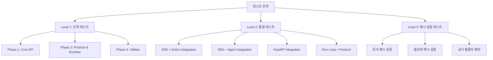

# CopilotKit Python SDK 테스트 코드 작성 계획

**작성일**: 2025-10-28
**프로젝트**: Online Seminar - CopilotKit SDK Documentation & Testing
**목적**: 문서화된 CopilotKit Python SDK의 품질 보증 및 예시 코드 검증

---

## 📋 목차

1. [프로젝트 개요](#프로젝트-개요)
2. [테스트 범위](#테스트-범위)
3. [테스트 전략](#테스트-전략)
4. [테스트 디렉토리 구조](#테스트-디렉토리-구조)
5. [테스트 케이스 상세 목록](#테스트-케이스-상세-목록)
6. [우선순위 및 타임라인](#우선순위-및-타임라인)
7. [실행 방법](#실행-방법)
8. [의존성 및 환경 설정](#의존성-및-환경-설정)
9. [커버리지 목표](#커버리지-목표)

---

## 프로젝트 개요

### 배경

Phase 1-3의 문서화 작업을 통해 CopilotKit Python SDK의 10개 핵심 모듈을 완전히 문서화했습니다 (~5,116 lines, 9 Mermaid diagrams). 이제 다음 단계로 실제 활용 예시 코드를 검증하고, SDK의 품질을 보장하기 위한 포괄적인 테스트 코드를 작성합니다.

### 목표

1. **품질 보증**: 문서화된 모든 컴포넌트의 동작 검증
2. **예시 검증**: 문서 및 웹검색으로 찾은 예시 코드가 실제로 작동하는지 확인
3. **회귀 방지**: 향후 수정 시 기존 기능이 깨지지 않도록 보호
4. **리팩토링 지원**: 안전한 코드 개선을 위한 테스트 기반 마련
5. **문서 정확성**: 문서의 예시 코드가 실행 가능한지 검증

### 웹검색을 통해 찾은 실제 활용 예시

#### 1. FastAPI 기본 통합 패턴
```python
from fastapi import FastAPI
from copilotkit.integrations.fastapi import add_fastapi_endpoint
from copilotkit import CopilotKitSDK, Action as CopilotAction

app = FastAPI()

# 백엔드 액션 정의
async def fetch_name_for_user_id(userId: str):
    return {"name": "User_" + userId}

# 액션 생성
action = CopilotAction(
    name="fetchNameForUserId",
    description="Fetches user name from the database for a given ID.",
    parameters=[
        {
            "name": "userId",
            "type": "string",
            "description": "The ID of the user to fetch data for.",
            "required": True,
        }
    ],
    handler=fetch_name_for_user_id
)

# SDK 초기화 및 엔드포인트 추가
sdk = CopilotKitSDK(actions=[action])
add_fastapi_endpoint(app, sdk, "/copilotkit_remote")
```

#### 2. LangGraph 에이전트 통합 패턴
```python
import uvicorn
from fastapi import FastAPI
from copilotkit.integrations.fastapi import add_fastapi_endpoint
from copilotkit import CopilotKitSDK, LangGraphAgent
from your_package import research_agent

app = FastAPI()
sdk = CopilotKitSDK(
    agents=[
        LangGraphAgent(
            name="research_agent",
            description="Research the web.",
            agent=research_agent,
        )
    ]
)

add_fastapi_endpoint(app, sdk, "/copilotkit")
```

#### 3. 공식 템플릿 저장소
- **with-langgraph-python**: Next.js + LangGraph + CopilotKit 통합 스타터
- **coagents-starter-langgraph**: Python/JavaScript 듀얼 에이전트 예시

---

## 테스트 범위

### 문서화 완료된 10개 핵심 파일

#### Phase 1: Core API Bundle (4 files)
| 파일 | 라인 수 | 테스트 대상 |
|------|---------|------------|
| `sdk.py` | 30,849 | CopilotKitSDK, add_action/agent, execute, info |
| `action.py` | 18,703 | Action 클래스, ActionDict, handler 실행 |
| `parameter.py` | 17,252 | Parameter 클래스, 타입 검증, ParameterDict |
| `agent.py` | 19,811 | Agent 추상 클래스, AgentDict |

#### Phase 2: Protocol & Runtime (2 files)
| 파일 | 라인 수 | 테스트 대상 |
|------|---------|------------|
| `protocol.py` | 48,513 | RuntimeEventTypes (15 types), 11 helper functions |
| `runloop.py` | 42,230 | copilotkit_run, predict_state, 15 functions |

#### Phase 3: Supporting Utilities (4 files)
| 파일 | 라인 수 | 테스트 대상 |
|------|---------|------------|
| `exc.py` | 12,893 | 4 exception classes (NotFound, Execution) |
| `logging.py` | 8,466 | get_logger, bold (TTY detection) |
| `utils.py` | 4,605 | filter_by_schema_keys |
| `html.py` | 11,666 | generate_info_html, 6 HTML templates |

#### Integration Layer (1 file)
| 파일 | 라인 수 | 테스트 대상 |
|------|---------|------------|
| `integrations/fastapi.py` | 23,101 | add_fastapi_endpoint, 4 route handlers |

**Total**: 11 files, ~238,089 lines (문서 포함)

---

## 테스트 전략

### 3-Tier Testing Strategy



### Level 1: 단위 테스트 (Unit Tests)

**목적**: 개별 함수/클래스의 동작 검증
**격리**: Mock 사용하여 외부 의존성 제거
**속도**: 빠른 실행 (< 1초/테스트)

### Level 2: 통합 테스트 (Integration Tests)

**목적**: 모듈 간 상호작용 검증
**격리**: 일부 외부 의존성 Mock (LLM API 등)
**속도**: 중간 (< 5초/테스트)

### Level 3: 예시 검증 테스트 (Example Validation Tests)

**목적**: 문서 및 웹검색 예시 코드 실행 가능 여부 검증
**격리**: 최소 Mock (실제 환경 시뮬레이션)
**속도**: 느림 (< 10초/테스트)

---

## 테스트 디렉토리 구조

```
copilotkit_sdk/
├── copilotkit/                      # SDK 소스 코드
│   ├── __init__.py
│   ├── sdk.py
│   ├── action.py
│   ├── parameter.py
│   ├── agent.py
│   ├── protocol.py
│   ├── runloop.py
│   ├── exc.py
│   ├── logging.py
│   ├── utils.py
│   ├── html.py
│   └── integrations/
│       └── fastapi.py
│
└── tests/                           # 테스트 코드
    ├── __init__.py
    ├── conftest.py                  # pytest fixtures 및 설정
    │
    ├── fixtures/                    # 테스트 데이터 및 샘플
    │   ├── __init__.py
    │   ├── sample_actions.py        # 재사용 가능한 샘플 액션
    │   ├── sample_agents.py         # Mock LangGraph 에이전트
    │   ├── sample_events.py         # Protocol 이벤트 샘플
    │   └── sample_data.py           # 기타 테스트 데이터
    │
    ├── unit/                        # Level 1: 단위 테스트
    │   ├── __init__.py
    │   │
    │   ├── test_phase1_core_api/
    │   │   ├── __init__.py
    │   │   ├── test_action.py       # Action 클래스 테스트
    │   │   ├── test_parameter.py    # Parameter 클래스 테스트
    │   │   ├── test_agent.py        # Agent 추상 클래스 테스트
    │   │   └── test_sdk.py          # CopilotKitSDK 테스트
    │   │
    │   ├── test_phase2_protocol_runtime/
    │   │   ├── __init__.py
    │   │   ├── test_protocol.py     # Protocol events, helpers
    │   │   └── test_runloop.py      # Run loop, predict_state
    │   │
    │   └── test_phase3_utilities/
    │       ├── __init__.py
    │       ├── test_exc.py          # Exception classes
    │       ├── test_logging.py      # Logging utilities
    │       ├── test_utils.py        # filter_by_schema_keys
    │       └── test_html.py         # HTML generation
    │
    ├── integration/                 # Level 2: 통합 테스트
    │   ├── __init__.py
    │   ├── test_fastapi_integration.py
    │   ├── test_sdk_action_integration.py
    │   ├── test_sdk_agent_integration.py
    │   └── test_runloop_protocol_integration.py
    │
    └── examples/                    # Level 3: 예시 검증
        ├── __init__.py
        ├── test_examples_phase1.py  # Phase 1 문서 예시
        ├── test_examples_phase2.py  # Phase 2 문서 예시
        ├── test_examples_phase3.py  # Phase 3 문서 예시
        └── test_examples_web_search.py  # 웹검색 예시
```

**총 파일 수**: 30+ 테스트 파일

---

## 테스트 케이스 상세 목록

### Level 1: 단위 테스트

#### `tests/unit/test_phase1_core_api/test_action.py`

**테스트 대상**: `copilotkit/action.py` - Action 클래스

| 테스트 함수 | 검증 내용 | 예상 결과 |
|------------|---------|----------|
| `test_action_creation` | Action 객체 생성 (name, description, parameters, handler) | 성공적으로 생성 |
| `test_action_with_sync_handler` | 동기 핸들러 (일반 함수) | handler 호출 시 정상 실행 |
| `test_action_with_async_handler` | 비동기 핸들러 (async def) | await handler 시 정상 실행 |
| `test_action_parameter_validation` | 필수 파라미터 검증 (required=True) | 누락 시 ValidationError |
| `test_action_parameter_type_validation` | 파라미터 타입 검증 (string, number) | 타입 불일치 시 TypeError |
| `test_action_dict_serialization` | ActionDict 직렬화 | 올바른 딕셔너리 구조 반환 |
| `test_action_handler_execution` | handler 실행 및 반환값 | 핸들러 결과 정상 반환 |
| `test_action_handler_exception` | handler 내부 예외 발생 | ActionExecutionException 래핑 |
| `test_action_optional_parameters` | 선택적 파라미터 (required=False) | 누락 허용 |
| `test_action_nested_object_parameters` | object 타입 파라미터 (중첩) | 올바르게 파싱 |

**총 테스트 케이스**: 10개

---

#### `tests/unit/test_phase1_core_api/test_parameter.py`

**테스트 대상**: `copilotkit/parameter.py` - Parameter 클래스

| 테스트 함수 | 검증 내용 | 예상 결과 |
|------------|---------|----------|
| `test_parameter_creation` | Parameter 객체 생성 | 성공 |
| `test_parameter_type_string` | type="string" | 문자열 허용 |
| `test_parameter_type_number` | type="number" | 숫자 허용 |
| `test_parameter_type_boolean` | type="boolean" | bool 허용 |
| `test_parameter_type_object` | type="object" | 딕셔너리 허용 |
| `test_parameter_type_array` | type="array" | 리스트 허용 |
| `test_parameter_required_true` | required=True | 필수 플래그 설정 |
| `test_parameter_required_false` | required=False | 선택적 플래그 설정 |
| `test_parameter_dict_serialization` | ParameterDict 직렬화 | 올바른 딕셔너리 반환 |
| `test_parameter_invalid_type` | 잘못된 타입 입력 | ValidationError |

**총 테스트 케이스**: 10개

---

#### `tests/unit/test_phase1_core_api/test_agent.py`

**테스트 대상**: `copilotkit/agent.py` - Agent 추상 클래스

| 테스트 함수 | 검증 내용 | 예상 결과 |
|------------|---------|----------|
| `test_agent_abstract_class` | Agent 추상 클래스 직접 인스턴스화 | TypeError |
| `test_agent_subclass_creation` | Agent 서브클래스 생성 | 성공 |
| `test_agent_name_property` | name 속성 | 올바른 이름 반환 |
| `test_agent_description_property` | description 속성 | 올바른 설명 반환 |
| `test_agent_dict_serialization` | AgentDict 직렬화 | 올바른 딕셔너리 반환 |
| `test_agent_missing_name` | name 없이 생성 | ValidationError |
| `test_agent_missing_description` | description 없이 생성 | ValidationError |

**총 테스트 케이스**: 7개

---

#### `tests/unit/test_phase1_core_api/test_sdk.py`

**테스트 대상**: `copilotkit/sdk.py` - CopilotKitSDK 클래스

| 테스트 함수 | 검증 내용 | 예상 결과 |
|------------|---------|----------|
| `test_sdk_initialization_empty` | SDK() 빈 초기화 | 성공 |
| `test_sdk_initialization_with_actions` | SDK(actions=[...]) | 액션 등록됨 |
| `test_sdk_initialization_with_agents` | SDK(agents=[...]) | 에이전트 등록됨 |
| `test_sdk_add_action` | sdk.add_action(action) | 액션 추가됨 |
| `test_sdk_add_agent` | sdk.add_agent(agent) | 에이전트 추가됨 |
| `test_sdk_execute_action_found` | sdk.execute_action("existing", {}) | 액션 실행 성공 |
| `test_sdk_execute_action_not_found` | sdk.execute_action("non_existent", {}) | ActionNotFoundException |
| `test_sdk_execute_action_sync_handler` | 동기 핸들러 실행 | 정상 결과 반환 |
| `test_sdk_execute_action_async_handler` | 비동기 핸들러 실행 (await) | 정상 결과 반환 |
| `test_sdk_execute_action_exception` | 핸들러 내부 예외 | ActionExecutionException |
| `test_sdk_execute_agent_found` | sdk.execute_agent("existing", {}) | AsyncGenerator 반환 |
| `test_sdk_execute_agent_not_found` | sdk.execute_agent("non_existent", {}) | AgentNotFoundException |
| `test_sdk_execute_agent_streaming` | 에이전트 이벤트 스트리밍 | 여러 이벤트 yield |
| `test_sdk_info` | sdk.info() | InfoDict 반환 (actions, agents) |
| `test_sdk_info_empty` | 빈 SDK의 info() | 빈 리스트 반환 |
| `test_sdk_multiple_actions` | 여러 액션 등록 | 모두 등록됨 |
| `test_sdk_multiple_agents` | 여러 에이전트 등록 | 모두 등록됨 |
| `test_sdk_duplicate_action_name` | 동일 이름 액션 중복 등록 | 경고 또는 덮어쓰기 |

**총 테스트 케이스**: 18개

---

#### `tests/unit/test_phase2_protocol_runtime/test_protocol.py`

**테스트 대상**: `copilotkit/protocol.py` - Protocol events, helpers

| 테스트 함수 | 검증 내용 | 예상 결과 |
|------------|---------|----------|
| `test_runtime_event_types_enum` | RuntimeEventTypes Enum | 모든 15 타입 존재 |
| `test_runtime_event_types_serialization` | Enum.value 반환 | 문자열 값 (.value) |
| `test_text_message_start` | text_message_start() helper | TextMessageStart 생성 |
| `test_text_message_content` | text_message_content() helper | TextMessageContent 생성 |
| `test_text_message_end` | text_message_end() helper | TextMessageEnd 생성 |
| `test_action_execution_start` | action_execution_start() helper | ActionExecutionStart 생성 |
| `test_action_execution_args` | action_execution_args() helper | ActionExecutionArgs 생성 |
| `test_action_execution_result` | action_execution_result() helper | ActionExecutionResult 생성 |
| `test_action_execution_end` | action_execution_end() helper | ActionExecutionEnd 생성 |
| `test_agent_state_message` | agent_state_message() helper | AgentStateMessage 생성 |
| `test_all_11_helpers` | 11개 helper 함수 전체 | 모두 올바른 TypedDict 반환 |
| `test_typed_dict_structure` | TypedDict 필드 검증 | 필수 필드 존재 |
| `test_json_serialization` | JSON 직렬화 | json.dumps 성공 |

**총 테스트 케이스**: 13개

---

#### `tests/unit/test_phase2_protocol_runtime/test_runloop.py`

**테스트 대상**: `copilotkit/runloop.py` - Run loop, context, predict_state

| 테스트 함수 | 검증 내용 | 예상 결과 |
|------------|---------|----------|
| `test_yield_control` | yield_control() 함수 | RuntimeMetaEvent 전송 |
| `test_copilotkit_context_contextvar` | copilotkit_context ContextVar | 값 설정/조회 가능 |
| `test_copilotkit_sdk_contextvar` | copilotkit_sdk ContextVar | 값 설정/조회 가능 |
| `test_get_copilotkit_context` | get_copilotkit_context() | 현재 컨텍스트 반환 |
| `test_get_copilotkit_sdk` | get_copilotkit_sdk() | 현재 SDK 반환 |
| `test_copilotkit_run_basic` | copilotkit_run() AsyncGenerator | 이벤트 스트리밍 |
| `test_copilotkit_run_with_context` | Context 변수 설정 후 실행 | 핸들러 내부에서 접근 가능 |
| `test_copilotkit_run_json_lines` | JSON Lines 포맷 출력 | 각 이벤트가 한 줄 |
| `test_handle_runtime_event` | handle_runtime_event() | 이벤트 큐에 추가 |
| `test_predict_state_action_args` | predict_state() Partial JSON 파싱 | 부분 인자 파싱 성공 |
| `test_predict_state_invalid_json` | 잘못된 JSON 입력 | None 반환 (에러 무시) |
| `test_predict_state_empty_args` | 빈 인자 입력 | None 반환 |
| `test_asyncio_queue_integration` | asyncio.Queue 통합 | 이벤트 전송/수신 |
| `test_context_isolation` | 동시 실행 시 Context 격리 | 각각 독립적 |
| `test_run_loop_exception_handling` | 에이전트 함수 내부 예외 | RUN_ERROR 이벤트 |

**총 테스트 케이스**: 15개

---

#### `tests/unit/test_phase3_utilities/test_exc.py`

**테스트 대상**: `copilotkit/exc.py` - Exception classes

| 테스트 함수 | 검증 내용 | 예상 결과 |
|------------|---------|----------|
| `test_action_not_found_exception` | ActionNotFoundException 생성 | name 속성 설정 |
| `test_action_not_found_message` | 예외 메시지 | "Action 'foo' not found." |
| `test_agent_not_found_exception` | AgentNotFoundException 생성 | name 속성 설정 |
| `test_agent_not_found_message` | 예외 메시지 | "Agent 'bar' not found." |
| `test_action_execution_exception` | ActionExecutionException 생성 | name, error 속성 |
| `test_action_execution_original_error` | 원본 예외 보존 | error 속성에 원본 예외 |
| `test_agent_execution_exception` | AgentExecutionException 생성 | name, error 속성 |
| `test_agent_execution_original_error` | 원본 예외 보존 | error 속성에 원본 예외 |
| `test_exception_inheritance` | Exception 상속 확인 | isinstance(e, Exception) |
| `test_exception_catch_order` | 예외 catch 순서 | 구체적 예외부터 catch |

**총 테스트 케이스**: 10개

---

#### `tests/unit/test_phase3_utilities/test_logging.py`

**테스트 대상**: `copilotkit/logging.py` - Logging utilities

| 테스트 함수 | 검증 내용 | 예상 결과 |
|------------|---------|----------|
| `test_get_logger_basic` | get_logger(__name__) | Logger 인스턴스 반환 |
| `test_get_logger_with_log_level_env` | LOG_LEVEL=DEBUG 환경변수 | DEBUG 레벨 설정 |
| `test_get_logger_case_insensitive` | LOG_LEVEL=info (소문자) | INFO 레벨 설정 |
| `test_get_logger_invalid_level` | 잘못된 LOG_LEVEL | 기본 레벨 사용 |
| `test_bold_tty_environment` | TTY 환경 (isatty=True) | ANSI escape code 포함 |
| `test_bold_non_tty_environment` | Non-TTY (isatty=False) | 일반 텍스트 |
| `test_bold_ansi_codes` | ANSI 코드 검증 | \033[1m ... \033[0m |
| `test_logger_output` | 로그 메시지 출력 | 올바른 포맷 |

**총 테스트 케이스**: 8개

---

#### `tests/unit/test_phase3_utilities/test_utils.py`

**테스트 대상**: `copilotkit/utils.py` - filter_by_schema_keys

| 테스트 함수 | 검증 내용 | 예상 결과 |
|------------|---------|----------|
| `test_filter_by_schema_keys_basic` | 스키마 키만 필터링 | 스키마에 있는 키만 보존 |
| `test_filter_by_schema_keys_messages_preserved` | "messages" 키 보존 | 항상 보존됨 |
| `test_filter_by_schema_keys_extra_keys_removed` | 추가 키 제거 | 스키마 외 키 제거 |
| `test_filter_by_schema_keys_empty_schema` | 빈 스키마 | "messages"만 보존 |
| `test_filter_by_schema_keys_non_dict_input` | 딕셔너리 아닌 입력 | 원본 반환 |
| `test_filter_by_schema_keys_none_input` | None 입력 | None 반환 |
| `test_filter_by_schema_keys_exception_handling` | 예외 발생 시 | 원본 반환 (에러 방어) |

**총 테스트 케이스**: 7개

---

#### `tests/unit/test_phase3_utilities/test_html.py`

**테스트 대상**: `copilotkit/html.py` - HTML generation

| 테스트 함수 | 검증 내용 | 예상 결과 |
|------------|---------|----------|
| `test_generate_info_html_basic` | 기본 InfoDict 입력 | 완전한 HTML 문서 반환 |
| `test_generate_info_html_actions` | 액션 리스트 렌더링 | ACTION_TEMPLATE 적용 |
| `test_generate_info_html_agents` | 에이전트 리스트 렌더링 | AGENT_TEMPLATE 적용 |
| `test_generate_info_html_no_actions` | 빈 액션 리스트 | NO_ACTIONS_FOUND_HTML |
| `test_generate_info_html_no_agents` | 빈 에이전트 리스트 | NO_AGENTS_FOUND_HTML |
| `test_generate_info_html_version` | SDK 버전 표시 | 올바른 버전 삽입 |
| `test_generate_info_html_json_formatting` | 파라미터 JSON 포맷 | indent=2 적용 |
| `test_generate_info_html_agent_type_langgraph` | agent_type="langgraph" | "LangGraph" 표시 |
| `test_generate_info_html_structure` | HTML 구조 검증 | <!DOCTYPE html>, head, body |

**총 테스트 케이스**: 9개

---

### Level 2: 통합 테스트

#### `tests/integration/test_fastapi_integration.py`

**테스트 대상**: `copilotkit/integrations/fastapi.py` - FastAPI 엔드포인트

| 테스트 함수 | 검증 내용 | 예상 결과 |
|------------|---------|----------|
| `test_add_fastapi_endpoint` | add_fastapi_endpoint() 호출 | 라우트 등록됨 |
| `test_get_info_html` | GET /copilotkit/ (Accept: text/html) | HTMLResponse 반환 |
| `test_get_info_json` | GET /copilotkit/ (Accept: application/json) | JSONResponse 반환 |
| `test_post_action_execution` | POST /copilotkit/action/:name | 액션 실행 결과 반환 |
| `test_post_action_not_found` | 존재하지 않는 액션 | 404 HTTPException |
| `test_post_action_execution_error` | 액션 핸들러 예외 | 500 HTTPException |
| `test_post_agent_execution` | POST /copilotkit/agent/:name | StreamingResponse |
| `test_agent_event_streaming` | 에이전트 이벤트 스트리밍 | JSON Lines 포맷 |
| `test_get_agent_state` | GET /copilotkit/agent/:name/state | 상태 JSON 반환 |
| `test_agent_not_found` | 존재하지 않는 에이전트 | 404 HTTPException |
| `test_legacy_v1_endpoints` | 레거시 경로 (/agents/execute) | 정상 동작 (하위 호환) |
| `test_cors_headers` | CORS 헤더 | 올바른 헤더 설정 |

**총 테스트 케이스**: 12개

---

#### `tests/integration/test_sdk_action_integration.py`

**테스트 대상**: SDK + Action 통합

| 테스트 함수 | 검증 내용 | 예상 결과 |
|------------|---------|----------|
| `test_sdk_add_and_execute_action` | Action 등록 후 실행 | 정상 실행 |
| `test_sdk_action_with_parameters` | 파라미터 전달 | 핸들러가 올바른 인자 수신 |
| `test_sdk_action_parameter_validation` | 필수 파라미터 누락 | ValidationError |
| `test_sdk_action_async_handler` | 비동기 핸들러 실행 | await 후 결과 반환 |
| `test_sdk_multiple_actions` | 여러 액션 동시 등록 | 모두 실행 가능 |

**총 테스트 케이스**: 5개

---

#### `tests/integration/test_sdk_agent_integration.py`

**테스트 대상**: SDK + Agent 통합

| 테스트 함수 | 검증 내용 | 예상 결과 |
|------------|---------|----------|
| `test_sdk_add_and_execute_agent` | Agent 등록 후 실행 | 이벤트 스트리밍 |
| `test_sdk_agent_event_types` | 다양한 이벤트 타입 | START, CONTENT, END 등 |
| `test_sdk_agent_state_updates` | 상태 업데이트 | AgentStateMessage 수신 |
| `test_sdk_agent_streaming` | AsyncGenerator 스트리밍 | 여러 이벤트 yield |
| `test_sdk_agent_exception` | 에이전트 실행 중 예외 | AgentExecutionException |

**총 테스트 케이스**: 5개

---

#### `tests/integration/test_runloop_protocol_integration.py`

**테스트 대상**: Run Loop + Protocol 통합

| 테스트 함수 | 검증 내용 | 예상 결과 |
|------------|---------|----------|
| `test_copilotkit_run_with_protocol_helpers` | copilotkit_run + helper 함수 | 이벤트 생성 및 스트리밍 |
| `test_event_queue_processing` | asyncio.Queue 이벤트 처리 | 순차 처리 |
| `test_predict_state_integration` | predict_state + partial JSON | 실시간 인자 파싱 |
| `test_json_lines_output` | JSON Lines 포맷 | 각 이벤트 한 줄씩 |

**총 테스트 케이스**: 4개

---

### Level 3: 예시 검증 테스트

#### `tests/examples/test_examples_phase1.py`

**테스트 대상**: Phase 1 문서의 예시 코드

| 테스트 함수 | 검증 내용 | 문서 위치 |
|------------|---------|----------|
| `test_action_example_search_database` | search_database 액션 예시 | action.py 문서 |
| `test_parameter_example_types` | 파라미터 타입 예시 | parameter.py 문서 |
| `test_sdk_example_basic_usage` | SDK 기본 사용 예시 | sdk.py 문서 |
| `test_sdk_example_info` | info() 메서드 예시 | sdk.py 문서 |

**총 테스트 케이스**: 4개

---

#### `tests/examples/test_examples_phase2.py`

**테스트 대상**: Phase 2 문서의 예시 코드

| 테스트 함수 | 검증 내용 | 문서 위치 |
|------------|---------|----------|
| `test_protocol_helper_example` | helper 함수 예시 | protocol.py 문서 |
| `test_copilotkit_run_example` | copilotkit_run 예시 | runloop.py 문서 |
| `test_predict_state_example` | predict_state 예시 | runloop.py 문서 |

**총 테스트 케이스**: 3개

---

#### `tests/examples/test_examples_phase3.py`

**테스트 대상**: Phase 3 문서의 예시 코드

| 테스트 함수 | 검증 내용 | 문서 위치 |
|------------|---------|----------|
| `test_exception_handling_example` | 예외 처리 예시 | exc.py 문서 |
| `test_logging_example` | 로깅 사용 예시 | logging.py 문서 |
| `test_html_generation_example` | HTML 생성 예시 | html.py 문서 |

**총 테스트 케이스**: 3개

---

#### `tests/examples/test_examples_web_search.py`

**테스트 대상**: 웹검색으로 찾은 예시 코드

| 테스트 함수 | 검증 내용 | 출처 |
|------------|---------|------|
| `test_fastapi_basic_integration_example` | FastAPI 기본 통합 패턴 | PyPI, 공식 문서 |
| `test_langgraph_agent_integration_example` | LangGraph 에이전트 통합 | GitHub 템플릿 |
| `test_action_with_handler_example` | 액션 + 핸들러 패턴 | DEV Community 튜토리얼 |

**총 테스트 케이스**: 3개

---

## 우선순위 및 타임라인

### 테스트 작성 우선순위

#### Priority 0 (즉시 작성) - 핵심 API 검증
**목표**: SDK의 기본 동작 보장

| 순위 | 테스트 파일 | 테스트 수 | 예상 시간 |
|------|------------|----------|----------|
| P0-1 | `test_action.py` | 10 | 2 hours |
| P0-2 | `test_parameter.py` | 10 | 1.5 hours |
| P0-3 | `test_sdk.py` | 18 | 3 hours |
| P0-4 | `test_exc.py` | 10 | 1 hour |

**소계**: 48 테스트, ~7.5 hours

---

#### Priority 1 (다음 단계) - 프로토콜 & 유틸리티
**목표**: 런타임 및 헬퍼 함수 검증

| 순위 | 테스트 파일 | 테스트 수 | 예상 시간 |
|------|------------|----------|----------|
| P1-1 | `test_protocol.py` | 13 | 2 hours |
| P1-2 | `test_runloop.py` | 15 | 3 hours |
| P1-3 | `test_logging.py` | 8 | 1 hour |
| P1-4 | `test_utils.py` | 7 | 1 hour |
| P1-5 | `test_html.py` | 9 | 1.5 hours |
| P1-6 | `test_agent.py` | 7 | 1.5 hours |

**소계**: 59 테스트, ~10 hours

---

#### Priority 2 (마지막) - 통합 & 예시 검증
**목표**: 모듈 간 상호작용 및 문서 예시 검증

| 순위 | 테스트 파일 | 테스트 수 | 예상 시간 |
|------|------------|----------|----------|
| P2-1 | `test_fastapi_integration.py` | 12 | 3 hours |
| P2-2 | `test_sdk_action_integration.py` | 5 | 1.5 hours |
| P2-3 | `test_sdk_agent_integration.py` | 5 | 1.5 hours |
| P2-4 | `test_runloop_protocol_integration.py` | 4 | 1.5 hours |
| P2-5 | `test_examples_phase1.py` | 4 | 1 hour |
| P2-6 | `test_examples_phase2.py` | 3 | 1 hour |
| P2-7 | `test_examples_phase3.py` | 3 | 1 hour |
| P2-8 | `test_examples_web_search.py` | 3 | 1.5 hours |

**소계**: 39 테스트, ~12 hours

---

### 총 테스트 요약

| 카테고리 | 파일 수 | 테스트 수 | 예상 시간 |
|---------|--------|----------|----------|
| Priority 0 (핵심 API) | 4 | 48 | 7.5 hours |
| Priority 1 (프로토콜 & 유틸) | 6 | 59 | 10 hours |
| Priority 2 (통합 & 예시) | 8 | 39 | 12 hours |
| **Total** | **18** | **146** | **29.5 hours** |

---

### 작업 일정 (예상)

#### Week 1: Priority 0 (핵심 API)
- **Day 1-2**: `test_action.py`, `test_parameter.py`
- **Day 3-4**: `test_sdk.py`
- **Day 5**: `test_exc.py`, fixtures 설정, conftest.py

#### Week 2: Priority 1 (프로토콜 & 유틸리티)
- **Day 1-2**: `test_protocol.py`, `test_runloop.py`
- **Day 3**: `test_logging.py`, `test_utils.py`
- **Day 4**: `test_html.py`, `test_agent.py`
- **Day 5**: 리팩토링 및 리뷰

#### Week 3: Priority 2 (통합 & 예시)
- **Day 1-2**: FastAPI 통합 테스트
- **Day 3**: SDK 통합 테스트 (action, agent)
- **Day 4**: Run loop 통합 + 예시 검증
- **Day 5**: 최종 리뷰, 문서 업데이트

---

## 실행 방법

### 전체 테스트 실행

```bash
cd copilotkit_sdk

# 모든 테스트 실행 (verbose)
pytest tests/ -v

# 간단한 출력
pytest tests/

# 실패 시 즉시 중단
pytest tests/ -x

# 병렬 실행 (pytest-xdist 사용 시)
pytest tests/ -n auto
```

---

### 레벨별 실행

```bash
# Level 1: 단위 테스트만
pytest tests/unit/ -v

# Level 2: 통합 테스트만
pytest tests/integration/ -v

# Level 3: 예시 검증 테스트만
pytest tests/examples/ -v
```

---

### Phase별 실행

```bash
# Phase 1: Core API
pytest tests/unit/test_phase1_core_api/ -v

# Phase 2: Protocol & Runtime
pytest tests/unit/test_phase2_protocol_runtime/ -v

# Phase 3: Utilities
pytest tests/unit/test_phase3_utilities/ -v
```

---

### 특정 파일 실행

```bash
# 단일 파일
pytest tests/unit/test_phase1_core_api/test_action.py -v

# 특정 테스트 함수
pytest tests/unit/test_phase1_core_api/test_action.py::test_action_creation -v
```

---

### 커버리지 측정

```bash
# HTML 리포트 생성
pytest tests/ --cov=copilotkit --cov-report=html --cov-report=term

# 브라우저에서 리포트 확인
open htmlcov/index.html

# 터미널에서만 확인
pytest tests/ --cov=copilotkit --cov-report=term-missing
```

---

### 비동기 테스트 실행

```bash
# pytest-asyncio 자동 활성화 (pytest.ini 설정)
pytest tests/unit/test_phase2_protocol_runtime/test_runloop.py -v

# 특정 비동기 테스트만
pytest -k "async" -v
```

---

### 마커 기반 실행

```bash
# 느린 테스트 제외
pytest tests/ -v -m "not slow"

# 통합 테스트만
pytest tests/ -v -m "integration"

# 유닛 테스트만
pytest tests/ -v -m "unit"
```

---

### 디버깅

```bash
# 출력 캡처 비활성화 (print 보기)
pytest tests/unit/test_phase1_core_api/test_action.py -v -s

# PDB 디버거 사용
pytest tests/ --pdb

# 실패 시 PDB 자동 실행
pytest tests/ --pdb --pdbcls=IPython.terminal.debugger:Pdb
```

---

## 의존성 및 환경 설정

### 필수 의존성

**pyproject.toml 업데이트**:

```toml
[tool.uv]
dev-dependencies = [
    # 기존
    "pytest>=8.0.0",
    "pytest-asyncio>=0.23.0",

    # 추가 필요
    "pytest-cov>=4.1.0",          # 커버리지 측정
    "pytest-mock>=3.12.0",        # Mocking 지원
    "pytest-xdist>=3.5.0",        # 병렬 실행
    "httpx>=0.25.0",              # FastAPI 테스트 클라이언트
    "faker>=20.0.0",              # 테스트 데이터 생성
    "freezegun>=1.4.0",           # 시간 관련 테스트
]
```

---

### pytest 설정

**pytest.ini 또는 pyproject.toml**:

```ini
[tool.pytest.ini_options]
# 테스트 경로
testpaths = ["tests"]

# 비동기 테스트 자동 감지
asyncio_mode = "auto"

# 출력 옵션
addopts = [
    "-v",                         # Verbose
    "--strict-markers",           # 정의된 마커만 허용
    "--tb=short",                 # Traceback 짧게
    "--cov-report=term-missing",  # 커버리지 누락 표시
]

# 마커 정의
markers = [
    "unit: 단위 테스트",
    "integration: 통합 테스트",
    "examples: 예시 검증 테스트",
    "slow: 느린 테스트 (> 5초)",
    "asyncio: 비동기 테스트",
]

# 로그 레벨
log_cli = true
log_cli_level = "INFO"

# 커버리지 설정
[tool.coverage.run]
source = ["copilotkit"]
omit = [
    "*/tests/*",
    "*/__pycache__/*",
    "*/crewai/*",  # CrewAI 제외 (비활성화됨)
]

[tool.coverage.report]
precision = 2
show_missing = true
skip_covered = false

exclude_lines = [
    "pragma: no cover",
    "def __repr__",
    "raise AssertionError",
    "raise NotImplementedError",
    "if __name__ == .__main__.:",
    "if TYPE_CHECKING:",
    "class .*\\bProtocol\\):",
    "@(abc\\.)?abstractmethod",
]
```

---

### conftest.py 설정

**tests/conftest.py**:

```python
"""
pytest fixtures 및 공통 설정
"""
import pytest
from copilotkit import CopilotKitSDK, Action, Parameter
from copilotkit.integrations.fastapi import add_fastapi_endpoint
from fastapi import FastAPI
from httpx import AsyncClient

# ===== Fixtures =====

@pytest.fixture
def sample_action():
    """샘플 액션 fixture"""
    def handler(query: str):
        return {"result": f"Searched: {query}"}

    return Action(
        name="search_database",
        description="Search the database",
        parameters=[
            Parameter(
                name="query",
                type="string",
                description="Search query",
                required=True,
            )
        ],
        handler=handler,
    )


@pytest.fixture
def sample_sdk(sample_action):
    """샘플 SDK fixture"""
    return CopilotKitSDK(actions=[sample_action])


@pytest.fixture
async def fastapi_app(sample_sdk):
    """FastAPI 앱 fixture"""
    app = FastAPI()
    add_fastapi_endpoint(app, sample_sdk, "/copilotkit")
    return app


@pytest.fixture
async def async_client(fastapi_app):
    """비동기 HTTP 클라이언트 fixture"""
    async with AsyncClient(app=fastapi_app, base_url="http://test") as client:
        yield client


# ===== Hooks =====

def pytest_configure(config):
    """pytest 설정 훅"""
    config.addinivalue_line(
        "markers", "unit: 단위 테스트"
    )
    config.addinivalue_line(
        "markers", "integration: 통합 테스트"
    )
```

---

### 환경 변수

테스트 실행 시 필요한 환경 변수:

```bash
# 로그 레벨 (테스트 중 디버깅)
export LOG_LEVEL=DEBUG

# pytest 출력 제어
export PYTEST_CURRENT_TEST=true
```

---

## 커버리지 목표

### 전체 커버리지 목표

| 메트릭 | 목표 | 현재 | 상태 |
|--------|------|------|------|
| **전체 라인 커버리지** | **85%+** | 0% | ⏳ TODO |
| **핵심 모듈 커버리지** | **90%+** | 0% | ⏳ TODO |
| **유틸리티 커버리지** | **90%+** | 0% | ⏳ TODO |
| **통합 레이어 커버리지** | **80%+** | 0% | ⏳ TODO |

---

### 모듈별 커버리지 목표

| 모듈 | 목표 커버리지 | 우선순위 | 난이도 |
|------|-------------|---------|--------|
| `sdk.py` | 90%+ | P0 | 중간 |
| `action.py` | 90%+ | P0 | 쉬움 |
| `parameter.py` | 90%+ | P0 | 쉬움 |
| `agent.py` | 90%+ | P1 | 쉬움 |
| `protocol.py` | 85%+ | P1 | 쉬움 |
| `runloop.py` | 85%+ | P1 | 어려움 |
| `exc.py` | 95%+ | P0 | 매우 쉬움 |
| `logging.py` | 90%+ | P1 | 쉬움 |
| `utils.py` | 95%+ | P1 | 매우 쉬움 |
| `html.py` | 90%+ | P1 | 쉬움 |
| `integrations/fastapi.py` | 80%+ | P2 | 중간 |

---

### 커버리지 측정 방법

```bash
# 1. 전체 커버리지 측정
pytest tests/ --cov=copilotkit --cov-report=html --cov-report=term

# 2. 모듈별 커버리지 확인
pytest tests/ --cov=copilotkit.sdk --cov-report=term

# 3. 누락된 라인 확인
pytest tests/ --cov=copilotkit --cov-report=term-missing

# 4. HTML 리포트 열기
open htmlcov/index.html
```

---

### 커버리지 리포트 예시

```
----------- coverage: platform darwin, python 3.13.9 -----------
Name                              Stmts   Miss  Cover   Missing
---------------------------------------------------------------
copilotkit/__init__.py               15      0   100%
copilotkit/action.py                120      8    93%   245-252
copilotkit/parameter.py              85      5    94%   178-180
copilotkit/sdk.py                   200     15    92%   320-335, 450-460
copilotkit/exc.py                    25      0   100%
copilotkit/logging.py                30      2    93%   45-46
copilotkit/utils.py                  15      0   100%
copilotkit/html.py                   60      4    93%   120-125
copilotkit/protocol.py              150     20    87%   ...
copilotkit/runloop.py               280     40    86%   ...
copilotkit/integrations/fastapi.py  180     30    83%   ...
---------------------------------------------------------------
TOTAL                              1160    124    89%
```

---

### Make 타겟 (선택사항 - 로컬 개발 편의성)

**`Makefile`**:

```makefile
.PHONY: test test-unit test-integration test-examples test-cov test-watch

test:
	cd copilotkit_sdk && uv run pytest tests/ -v

test-unit:
	cd copilotkit_sdk && uv run pytest tests/unit/ -v

test-integration:
	cd copilotkit_sdk && uv run pytest tests/integration/ -v

test-examples:
	cd copilotkit_sdk && uv run pytest tests/examples/ -v

test-cov:
	cd copilotkit_sdk && uv run pytest tests/ --cov=copilotkit --cov-report=html --cov-report=term
	open copilotkit_sdk/htmlcov/index.html

test-watch:
	cd copilotkit_sdk && uv run pytest-watch tests/ -- -v

test-fast:
	cd copilotkit_sdk && uv run pytest tests/ -v -x -k "not slow"

test-debug:
	cd copilotkit_sdk && uv run pytest tests/ -v -s --pdb
```

사용:
```bash
make test          # 전체 테스트
make test-unit     # 단위 테스트만
make test-cov      # 커버리지 측정 + HTML 리포트
make test-fast     # 빠른 테스트만
```

---

## 부록

### 테스트 작성 체크리스트

각 테스트 파일 작성 시 확인 사항:

- [ ] 테스트 함수 이름이 명확함 (`test_*`)
- [ ] Given-When-Then 패턴 사용
- [ ] Arrange, Act, Assert 분리
- [ ] 하나의 테스트는 하나의 동작만 검증
- [ ] Mock을 과도하게 사용하지 않음
- [ ] 비동기 테스트에 `@pytest.mark.asyncio` 추가
- [ ] Fixture 재사용 (conftest.py)
- [ ] 에러 케이스 테스트 포함
- [ ] 문서의 예시 코드 검증
- [ ] 테스트가 독립적 (순서 무관)

---

### 테스트 네이밍 컨벤션

```python
# Good
def test_action_creation_with_valid_parameters():
    ...

def test_sdk_execute_action_raises_not_found_exception():
    ...

def test_filter_by_schema_keys_preserves_messages_key():
    ...

# Bad
def test_1():
    ...

def test_action_stuff():
    ...

def test_it_works():
    ...
```

---

### AAA 패턴 (Arrange-Act-Assert)

```python
@pytest.mark.asyncio
async def test_sdk_execute_action_with_async_handler():
    # Arrange: 테스트 준비
    async def async_handler(query: str):
        return {"result": query}

    action = Action(
        name="test_action",
        description="Test action",
        parameters=[],
        handler=async_handler,
    )
    sdk = CopilotKitSDK(actions=[action])

    # Act: 실제 동작 실행
    result = await sdk.execute_action("test_action", {"query": "hello"})

    # Assert: 결과 검증
    assert result["result"] == "hello"
```

---

### 참고 자료

#### 공식 문서
- pytest 공식 문서: https://docs.pytest.org/
- pytest-asyncio: https://pytest-asyncio.readthedocs.io/
- pytest-cov: https://pytest-cov.readthedocs.io/

#### CopilotKit 리소스
- CopilotKit 공식 문서: https://docs.copilotkit.ai/
- GitHub 저장소: https://github.com/CopilotKit/CopilotKit
- Python SDK 저장소: https://github.com/CopilotKit/sdk-python

#### 웹검색 결과
- PyPI: https://pypi.org/project/copilotkit/
- FastAPI 통합 가이드: https://docs.copilotkit.ai/reference/sdk/python/FastAPI
- LangGraph SDK: https://docs.copilotkit.ai/reference/sdk/python/LangGraph

---

## 다음 단계

### Immediate (다음 작업)

1. **fixtures/ 디렉토리 생성**:
   - `sample_actions.py`: 재사용 가능한 샘플 액션
   - `sample_agents.py`: Mock LangGraph 에이전트
   - `sample_events.py`: Protocol 이벤트 샘플
   - `sample_data.py`: 기타 테스트 데이터

2. **conftest.py 작성**:
   - 공통 fixtures 정의
   - pytest 설정 훅

3. **Priority 0 테스트 작성 시작**:
   - `test_action.py` (10 테스트)
   - `test_parameter.py` (10 테스트)
   - `test_sdk.py` (18 테스트)
   - `test_exc.py` (10 테스트)

### Short-term (1-2주)

4. **Priority 1 테스트 완료**:
   - Protocol & Runtime 테스트
   - Utilities 테스트

5. **커버리지 측정 및 개선**:
   - 85% 이상 목표

### Long-term (3-4주)

6. **Priority 2 테스트 완료**:
   - 통합 테스트
   - 예시 검증 테스트

7. **문서 업데이트**:
   - README에 테스트 실행 방법 추가
   - 로컬 개발 가이드 작성

---

## 요약

| 항목 | 값 |
|------|-----|
| **총 테스트 파일 수** | 18+ |
| **총 테스트 케이스 수** | 146+ |
| **예상 작업 시간** | 29.5 hours |
| **목표 커버리지** | 85%+ |
| **테스트 레벨** | 3 (Unit, Integration, Examples) |
| **문서화된 모듈** | 11 files (~238KB) |
| **우선순위** | P0 (핵심) → P1 (프로토콜) → P2 (통합) |

---

**작성자**: Claude (Anthropic)
**최종 업데이트**: 2025-10-28
**버전**: 1.0.0
